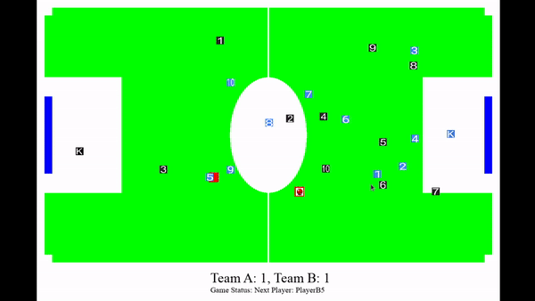

# pyfootball - A reinforcement learning environment for football game using model-free markov process 
A Reinforcement Learning environment built using pygame.

Game formation for each Team: 4:3:3




Experiment by following this commands.

``` 
git clone https://github.com/elishatofunmi/pyfootball.git

cd "pyfootball"

pip install -r requirements.txt

python pyfootball.py

```


